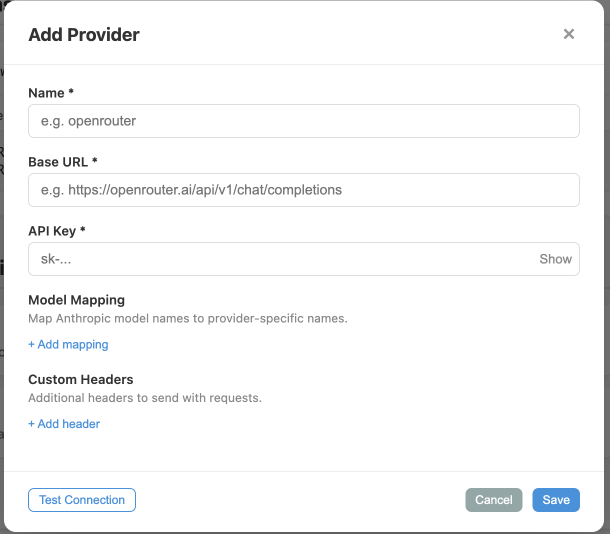

# Claude Code Fallback Proxy

[](https://codecov.io/gh/broven/claude-code-fallback)

A fallback proxy for Claude Code (or any Anthropic API client). When you hit rate limits or API errors, automatically routes to alternative providers.
just like [vercel](https://vercel.com/changelog/claude-code-max-via-ai-gateway-available-now-for-claude-code) and [openreouter](https://openrouter.ai/docs/guides/guides/claude-code-integration) does

## Why This Exists

When using Claude Code or other Anthropic API clients, you might encounter:
- **Rate limits (429)** — Your API quota is exhausted
- **Service errors (5xx)** — Temporary Anthropic API downtime
Instead of manually switching between providers, this proxy automatically fails over to your configured alternatives.

## How It Works

```
Claude Code ──► Fallback Proxy ──► Anthropic API
                     │                   ✗ 429/403/5xx
                     │
                     └──► Provider 1 ──► Provider 2 ──► ...
```

The proxy intercepts API requests. When the Anthropic API returns an error eligible for fallback (401, 403, 429, or 5xx), requests are forwarded to your configured fallback providers in order until one succeeds.

### Fallback Strategy

When a request fails, the proxy:

1. **Tries Anthropic API first** — Your primary requests always go to the official API
2. **Detects eligible errors** — Only fallback on: 401, 403, 429, 5xx (not on 4xx client errors)
3. **Iterates through providers** — Tries each configured provider in order
4. **Returns first success** — Or the last error if all fail

**Model Mapping**: Configure model name translation (e.g., `claude-3-opus-20240229` → `anthropic/claude-3-opus`) per provider to ensure compatibility.

## ⚠️ Important Notice

**Use at your own risk.** I have not reviewed Anthropic's Terms of Service to confirm whether using a proxy is permitted. There is a possibility that using this proxy could violate their terms and result in account suspension.

**Current status:** I've been using this proxy personally without issues, but that doesn't guarantee it's safe for all users. Please review [Anthropic's Terms of Service](https://www.anthropic.com/legal/consumer-terms) yourself before deploying, and use this tool at your own discretion.

## Quick Start

### 1. Deploy to Cloudflare

Click the button below to deploy your own instance:

[](https://deploy.workers.cloudflare.com/?url=https://github.com/broven/claude-code-fallback)

During deployment, you'll be prompted to:
- **Set ADMIN_TOKEN** — Choose a secure token to protect your admin panel
- **Create KV namespace** — Cloudflare will create this automatically

### 2. Configure Providers

After deployment, open your admin panel:

```
https://your-worker.workers.dev/admin?token=YOUR_ADMIN_TOKEN
```


Click **"Add Provider"** and configure your fallback:



**Required fields:**
- **Name**: Any identifier (e.g., "openrouter", "bedrock")
- **Base URL**: API endpoint (e.g., `https://openrouter.ai/api/v1/chat/completions`)
- **API Key**: Your authentication credential

**Optional fields:**
- **Auth Header**: Header name for the key (default: `x-api-key`, use `Authorization` for Bearer tokens)
- **Model Mapping**: Map model names between providers (JSON format)

Example model mapping:
```json
{
  "claude-3-opus-20240229": "anthropic/claude-3-opus",
  "claude-3-sonnet-20240229": "anthropic/claude-3-sonnet"
}
```

### 3. Use in Claude Code

After configuring providers, click the **"Show Environment Config"** button in the admin panel:


Add these to your Claude Code settings or environment:

**For Claude Code CLI:**
```bash
export ANTHROPIC_BASE_URL=https://your-worker.workers.dev
export ANTHROPIC_API_KEY=your-original-anthropic-key
```

**For `.env` file:**
```bash
ANTHROPIC_BASE_URL=https://your-worker.workers.dev
ANTHROPIC_API_KEY=your-original-anthropic-key
```

That's it! Claude Code will now automatically fallback when needed.


## Development

### Local Setup
```bash
npm install
npm run dev
# Visit http://localhost:8787/admin?token=dev-token
```

### Testing
```bash
npm test                  # Run all tests
npm run test:watch        # Watch mode
npm run test:coverage     # Coverage report
```


### Deployment
```bash
npm run deploy            # Deploy to Cloudflare
npm run tail              # Stream production logs
```

## License

Anti 996-License
